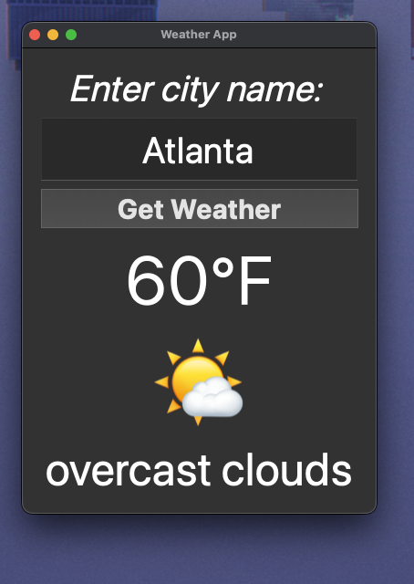
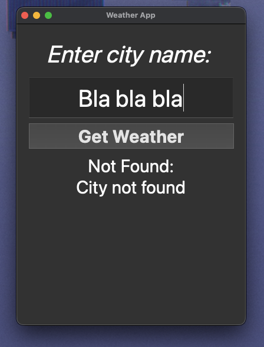

# Weather App 🌤️

A simple desktop weather application built with Python and PyQt5 that displays real-time weather data using the OpenWeatherMap API.

## Screenshots

### Weather Output


### Error Handling


## Features
- Search weather by city name
- Displays temperature in Fahrenheit
- Weather emoji icons based on conditions
- Error handling for invalid cities and network issues

## Technologies Used
- Python
- PyQt5
- OpenWeatherMap API
- Requests library

## Setup
1. Clone the repo
2. Install dependencies:
```bash
   pip install PyQt5 requests
```
3. Run the app:
```bash
   python main.py
```